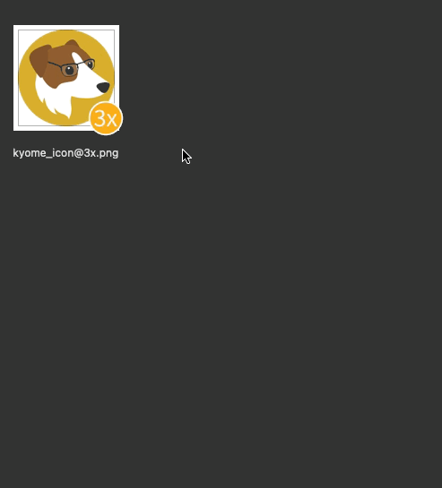
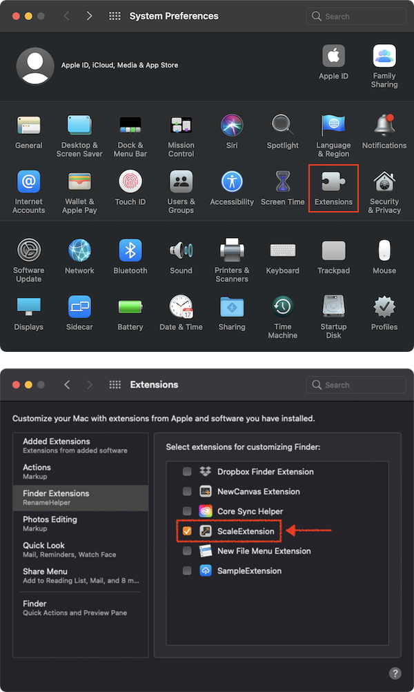

# scalehelper

<!-- # Short Description -->

This tool is useful for resizing images for Retina resolution.

<!-- # Badges -->

# Tags

`macOS` `Finder Sync Extension` `Resize` `Swift`

# Demo

1. Select an image file which suffix of the name is "@2x" or "@3x".
2. Open the context menu by right-clicking.
3. Select "Generate a 1x image" or "Generate 1x and 2x images".

# Advantages

- Simple
- Quick
- Clarity

# Installation

- Open System Preferences -> Extensions.
- Check the box of "ScaleHelper Extension".

# Contributors

- [Kyome22](https://github.com/Kyome22)

<!-- CREATED_BY_LEADYOU_README_GENERATOR -->
